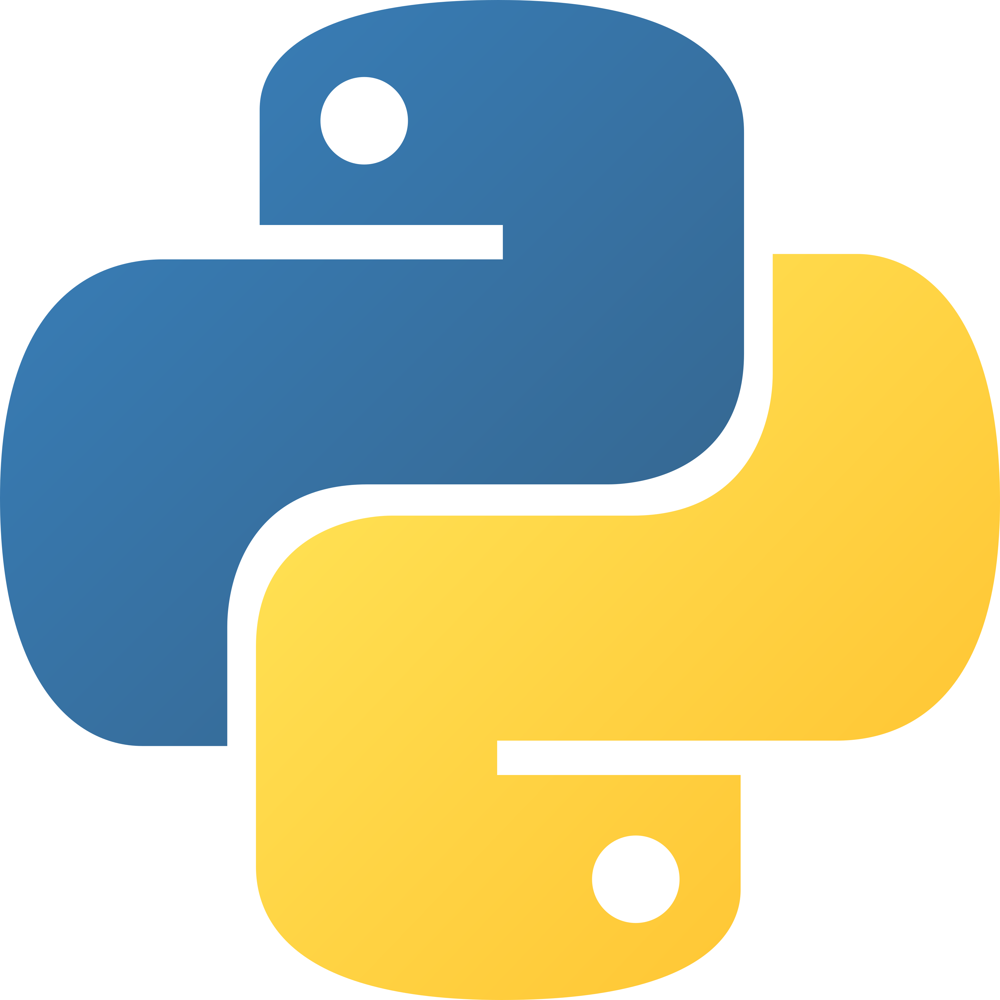

# Python Basics



> **Python** - [Python is powerful... and fast;
plays well with others;
runs everywhere;
is friendly & easy to learn;
is Open.](https://www.python.org/about/#:~:text=Python%20is%20powerful...%20and%20fast%3B%0Aplays%20well%20with%20others%3B%0Aruns%20everywhere%3B%0Ais%20friendly%20%26%20easy%20to%20learn%3B%0Ais%20Open.)
>
> ***[This repository is not intended to be a complete python guide. It serves as my personal reference, experiment log, and learning journal as I study the language.]***

## Sections

### Core ELements

> #### The basics
> * ***[CS Circle](/csCircle/PythonCScircle.md)***
> * ***[Extra Python](/extraPython/ExtraPython.md)***
> 
> #### Utility
> * ***[`Modules`](/modules/Modules.md)***

### Ecosystem & Distribution

> * ***[Packaging Projects](/packaging/Packaging.md)***

### Environment & Package Management

> * ***[`pip`](/pip/Pip.md)***
> * ***[`Virtual Environment`](/virtualEnvironment/VirtualEnvironment.md)***

### Python Libraries

> * ***[GUI](GUI/GUI.md)***
> * ***[NumPy](numpy/Numpy.md)***

---

**Important**

```bash
python -m pip
python -m venv
python -m http.server
python -m json.tool
```

> Basically saying "Look at the **Module** named **pip**/ **venv**/ **http.server**/ **json.tool**/ **...** and run it as script"