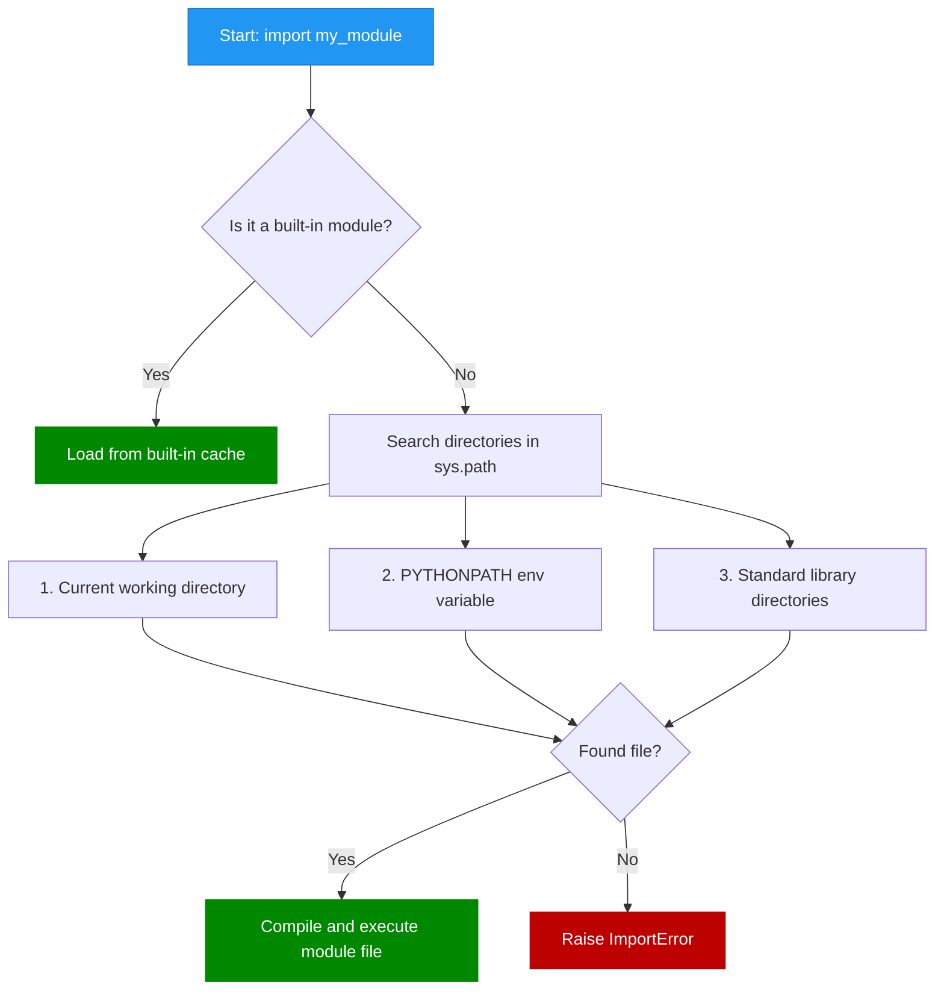

# Modules

[:arrow_left: Return to Main README](../README.md)

[:arrow_right: Read on Packages](/modules/packaging/Packaging.md)  
[:arrow_right: Read on Unittest](/modules/unittesting/Unittest.md)

:arrow_right: [Link to **Modules** Learning Material](https://docs.python.org/3/tutorial/modules.html)  
:arrow_right: [About `sys.path`](https://docs.python.org/3/library/sys_path_init.html)

## Sections

> * [Overview](#overview)
> * [Core Implementation](#core-implementation)

---

### [Overview](#sections)


---

### [Core Implementation](#sections)

***Syntax: Python (Modules.py)***

```python
moduleVariable = "This is a module Variable"
moduleVariable2 = 1
moduleVariable3 = 2

_SpecialVariable = "Underscored Variable"

def moduleFunction():
    internalMessage = "This is a text coming from the [moduleFunction]"
    return internalMessage
```

***Syntax: Python (Execution Flow)***

```python
# 1. Standard Import
import Modules

print(dir(Modules)) # Lists all accessible names within the module scope
print(Modules.moduleFunction())
print(Modules.moduleVariable)
print("Module Variable 1: " + Modules.moduleVariable)
print("Module Variable 2: " + str(Modules.moduleVariable2))
print("Module Variable 3: " + str(Modules.moduleVariable3))
print("Variable 2 + Variable 3 = " + str(Modules.moduleVariable2 + Modules.moduleVariable3))
print("_SpecialVariable: " + Modules._SpecialVariable)

# 2. Wildcard Import
from Modules import *

print(moduleFunction())
print(moduleVariable)
print("Module Variable 1: " + moduleVariable)
print("Module Variable 2: " + str(moduleVariable2))
print("Module Variable 3: " + str(moduleVariable3))
print("Variable 2 + Variable 3 = " + str(moduleVariable2 + moduleVariable3))
# print(_SpecialVariable) # Triggers NameError: _SpecialVariable cannot be seen

# 3. Rename Import (Alias Namespace)
import Modules as customModuleName

print(moduleFunction())
print(customModuleName.moduleVariable)
print("Module Variable 1: " + customModuleName.moduleVariable)
print("Module Variable 2: " + str(customModuleName.moduleVariable2))
print("Module Variable 3: " + str(customModuleName.moduleVariable3))
print("Variable 2 + Variable 3 = " + str(customModuleName.moduleVariable2 + customModuleName.moduleVariable3))
print("_SpecialVariable: " + customModuleName._SpecialVariable)

# State Mutation Rule
moduleVariable2 = 5
print("It will still print the original: " + str(Modules.moduleVariable2))
```

***Syntax: Python (Script Guard)***

```python
def main_execution_logic():
    pass

# Direct vs Import Execution Guard
if __name__ == '__main__':
    # This block ONLY runs if the file is executed directly as a script.
    # It will NOT run if this file is imported as a module elsewhere.
    main_execution_logic()
```

> [!NOTE]
> **The `if __name__ == '__main__'` block prevents code from running automatically when a file is imported by another script.** Since Python executes everything in a file during an import, this guard ensures tests or examples only run when executing the file directly.

> [!TIP]
> **Variables prefixed with a single underscore (like `_SpecialVariable`) are skipped during wildcard imports (`from Modules import *`).** Explicitly stating the module namespace (e.g., `Modules._SpecialVariable` or via an alias) ignores this boundary and resolves the reference successfully.

> [!WARNING]
> **Modifying an imported variable locally creates a new reference in your local scope.** It will not overwrite or mutate the value preserved inside the source module's global namespace.
