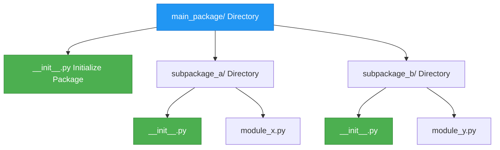

# Packaging

[:arrow_left: Return to Main README](/README.md)

[:arrow_left: Read on Modules](/modules/Modules.md)  
[:arrow_right: Read on Unittest](/modules/unittesting/Unittest.md)

:arrow_right: [Link to **Packages** Learning Material](https://python.org)
:arrow_right: [Link to **Packaging Index**](https://pypi.org)

## Sections

> * [Overview](#overview)
> * [Core Implementation](#core-implementation)
> * [__init__.py Execution](#__init__py-execution)

---

### [Overview](#sections)


---

### [Core Implementation](#sections)

***Syntax: Python***

```python
# Absolute Import: Full path from the top-level package downward
from main_package.subpackage_a import module_x

# Relative Import: Using dots to navigate from the current directory
from . import module_z       # .  = Same directory (subpackage_b)
from .. import subpackage_a  # .. = One directory up (main_package)
```

***Syntax: Python***

```python
# Controls wildcard exports. Explicitly sets what 'from package import *' loads.
__all__ = ["module_x"]
```

---

### [__init__.py Execution](#sections)

***Syntax: Python (Namespace Elevation)***

```python
# Elevating internal module assets directly to the package interface level
from .module_a import MainClass
from .module_b import SecondaryClass

# Grouped relative imports for structural module constants
from .constants_file import (FirstVariable, SecondVariable)

# Explicit definition of the exposed package API namespace
__all__ = [
    "MainClass",
    "SecondaryClass",
    "FirstVariable",
    "SecondVariable",
]
```

> [!NOTE]
> **Without `__all__`, running `from package import *` imports everything in the file—including internal tools like `import os`.** By defining `__all__ = ['func1', 'Class2']`, Python is forced to *only* export those specific items, creating a clean public interface while keeping the setup code hidden.

