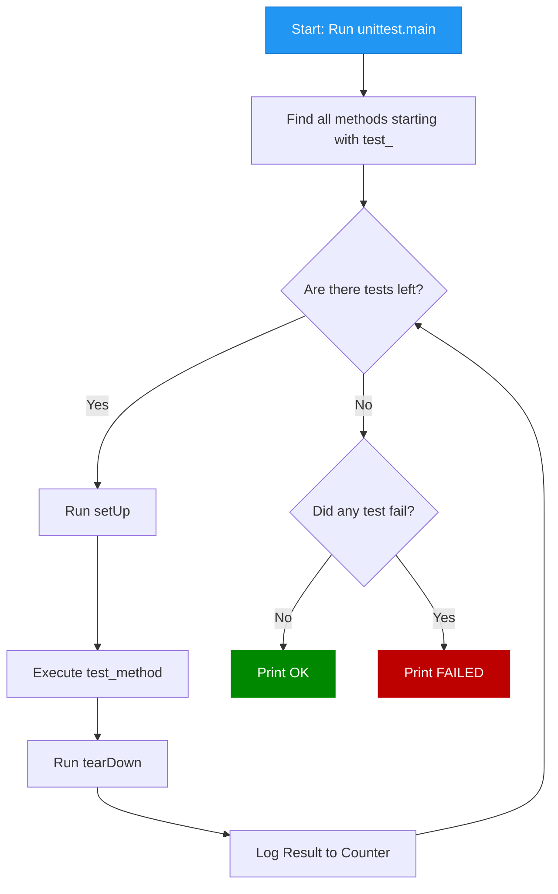

# Unittest

[:arrow_left: Return to Main README](/README.md)

[:arrow_left: Read on Modules](/modules/Modules.md)  
[:arrow_left: Read on Packages](/modules/packaging/Packaging.md)

:arrow_right: [Link to **Packages** Learning Material](https://python.org)

## Sections

> * [Overview](#overview)
> * [Core Implementation](#core-implementation)
> * [Terminal Execution](#terminal-execution)
> * [Common Assertions Reference](#common-assertions-reference)

---

### [Overview](#sections)


---

### [Core Implementation](#sections)

***Syntax: Python***

```python
import unittest

class InspectionChecklist(unittest.TestCase):

    def setUp(self):
        # Runs before each test to guarantee a fresh, isolated state
        self.state = "Initial State"

    def test_passing_assertion(self):
        # Passes silently because actual == expected. No error is raised.
        self.assertEqual(self.state, "Initial State")

    def test_expected_error_trap(self):
        # Passes because ZeroDivisionError is raised inside the context manager trap.
        with self.assertRaises(ZeroDivisionError):
            _ = 1 / 0

if __name__ == '__main__':
    # Loops over all 'test_' methods inside try/except. Prints 'OK' if failures == 0.
    unittest.main()
```

***Result:***

```txt
..
----------------------------------------------------------------------
Ran 2 tests in 0.001s

OK
```

---

### [Terminal Execution](#sections)

***Syntax: Bash***

```bash
# Run tests normally (Standard dot notation output)
python3 test_file.py

# Run tests in verbose mode (Lists each test method name and status)
python3 test_file.py -v

# Run Python's built-in test runner explicitly
python3 -m unittest test_file.py
```

---

### [Common Assertions Reference](#sections)

| Method | Check Condition |
| :--- | :--- |
| `self.assertEqual(a, b)` | `a == b` |
| `self.assertNotEqual(a, b)` | `a != b` |
| `self.assertTrue(x)` | `bool(x) is True` |
| `self.assertFalse(x)` | `bool(x) is False` |
| `self.assertIsNone(x)` | `x is None` |
| `self.assertIn(item, container)` | `item in container` |
| `with self.assertRaises(Error):` | Traps and validates expected exceptions |
